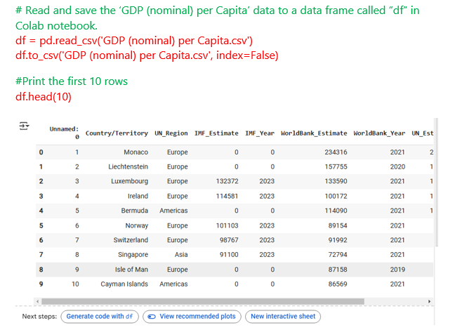
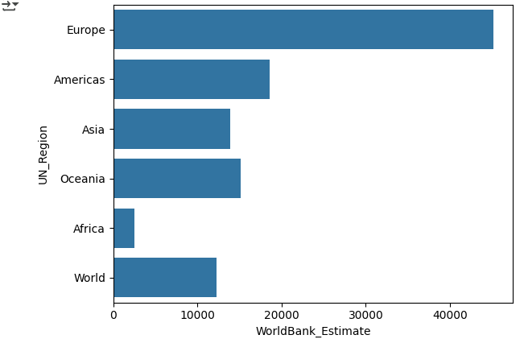
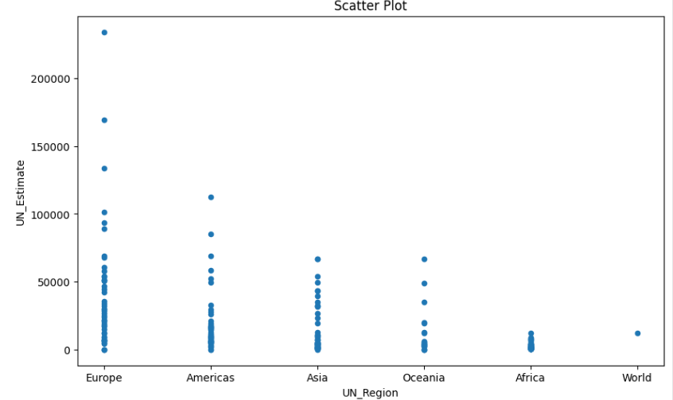
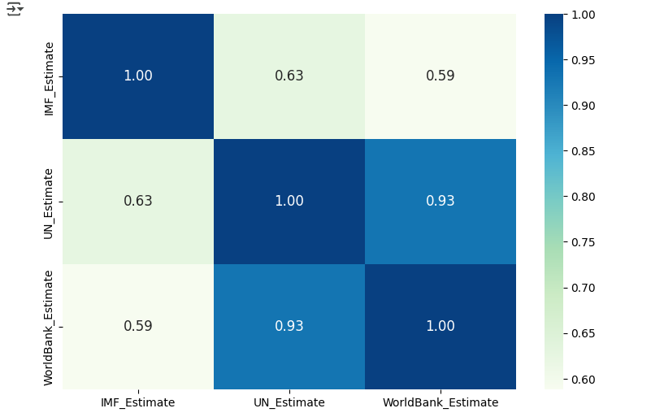
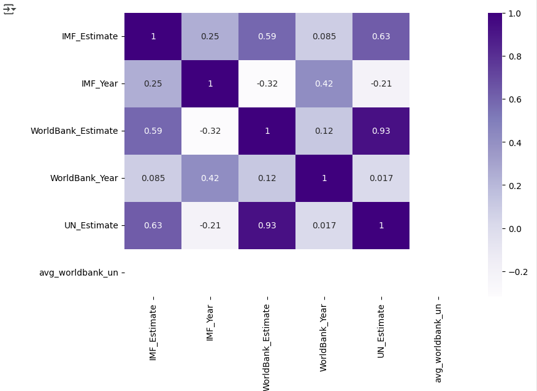

## Data Analysis and Visualisation in Python

**Please download the ‘GDP (nominal) per Capita.csv’ dataset  [here.](https://justit831-my.sharepoint.com/:x:/g/personal/danpe_justit_co_uk/EV1Xzb5eNENHmOVMDssxyoMBqTCVcLg18U4qOLUDZZHSkw?e=PAbKfN)**

In this project, we used Python to extract and analyse specific data from the 'GDP (Nominal) per Capita.csv' dataset. Our first step was to load the data from the CSV file into a DataFrame named "df" using Colab notebook. To quickly explore the dataset, we printed the first 10 rows, providing a snapshot of the data.

The Syntax and output are shown below

To assist with the visual analysis of the data, we employed several visualisation techniques, including bar plots, scatter plots, and box plots. These visualisations were instrumental in uncovering patterns, distributions, and relationships within the data, allowing us to gain deeper insights.

Additionally, we used Python’s correlation function to explore the relationships between the estimates provided by the World Bank, UN, and IMF. By analysing these correlations, we were able to understand how the estimates from these organisations align or differ, providing valuable context for the dataset.

**Data Source: Just IT**

**Full Project work book [here.](https://drive.google.com/file/d/1Ujbhgj5IOaii1iC4cDKUABNVXpV7x9B9/view?usp=drive_link)**

**Click [here](https://github.com/Alamin-analyser/Analysing-Visualising-Data-in-Python) to see another Python Project.**
